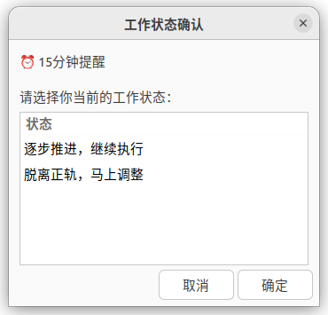
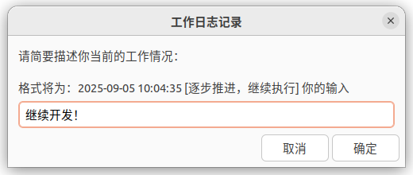
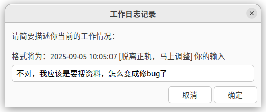
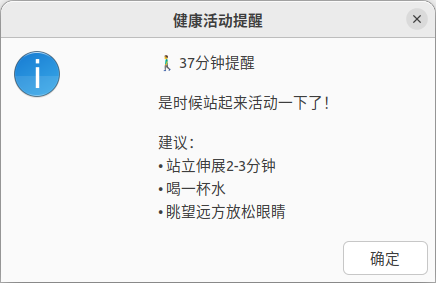
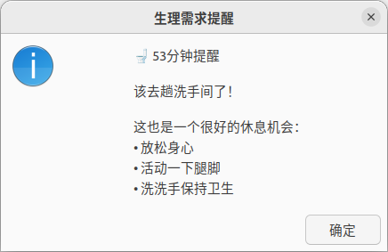
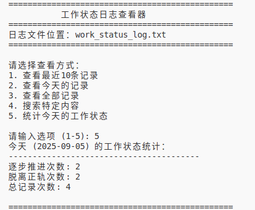

# 🏥 Ubuntu健康提醒系统

一个基于Zenity的Ubuntu桌面健康提醒工具，帮助提高工作效率和保持健康的工作习惯。

## ✨ 功能特性

### 🔔 智能提醒系统
- **工作状态确认** (每15分钟)：确认当前工作方向是否正确，并记录工作日志
- **活动喝水提醒** (每37分钟)：提醒站立活动和补充水分
- **生理需求提醒** (每53分钟)：提醒上厕所，保持健康作息

### 📝 工作日志记录
- 自动记录工作状态和进展
- 支持两种状态分类：`逐步推进，继续执行` 和 `脱离正轨，马上调整`
- 时间戳格式：`2025-09-05 09:48:01 [状态] 具体描述`
- 日志按日期分组显示，便于回顾

### 📊 日志查看工具
- 查看最近10条记录
- 按日期筛选记录
- 关键词搜索功能
- 工作状态统计分析

## 🖼️ 界面预览

### 1. 提醒功能与日志记录











### 2. 工作状态日志查看器



## 🚀 快速开始

### 系统要求
- Ubuntu 18.04+ (其他基于GTK的Linux发行版也支持)
- Zenity (Ubuntu原生对话框工具)

### 安装依赖

```bash
sudo apt update
sudo apt install zenity
```

### 下载使用

```bash
# 克隆仓库
git clone https://github.com/JyiDeng/zensity_health_reminder_ubuntu.git
cd zensity_health_reminder_ubuntu

# 添加执行权限
chmod +x reminder_health.sh view_work_log.sh

# 启动健康提醒系统
./reminder_health.sh
```

## 📖 使用说明

### 启动提醒系统

```bash
./reminder_health.sh
```

启动后会显示以下信息：
```
启动健康提醒系统...
包含三个提醒模块：
1. 工作确认提醒 (每15分钟)
2. 活动喝水提醒 (每37分钟)
3. 上厕所提醒 (每53分钟)

按 Ctrl+C 停止所有提醒
```

### 查看工作日志

```bash
./view_work_log.sh
```

提供以下查看选项：
1. 查看最近10条记录
2. 查看今天的记录
3. 查看全部记录
4. 搜索特定内容
5. 统计今天的工作状态

### 日志格式示例

```
================================================
2025-09-05
================================================
2025-09-05 09:48:01 [脱离正轨，马上调整] 我的任务应该是审阅pr，我居然在修pr的内容，这不对！
2025-09-05 09:33:01 [逐步推进，继续执行] 目前把git分支修好了，继续下一个任务
```

## 🛠️ 自定义配置

### 修改提醒间隔

编辑 `reminder_health.sh` 文件中的时间间隔：

```bash
# 工作确认提醒间隔 (默认15分钟 = 900秒)
sleep 900

# 活动喝水提醒间隔 (默认37分钟 = 2220秒)  
sleep 2220

# 生理需求提醒间隔 (默认53分钟 = 3180秒)
sleep 3180
```

### 修改提醒内容

在相应的函数中修改 `zenity` 命令的 `--text` 参数即可自定义提醒内容。

## 📁 文件结构

```
zensity_health_reminder_ubuntu/
├── README.md                # 项目说明文档
├── reminder_health.sh       # 主要的健康提醒脚本
├── view_work_log.sh        # 工作日志查看工具
├── work_status_log.txt     # 自动生成的工作日志文件
├── image*.png              # 界面截图
└── pic/                    # 额外图片资源
    └── image.png
```

## 🤝 贡献指南

欢迎提交Issue和Pull Request来改进这个项目！

### 开发建议
- 遵循Shell脚本最佳实践
- 添加必要的错误处理
- 保持代码简洁易懂
- 添加适当的注释

## 📄 许可证

本项目采用 MIT 许可证 - 查看 [LICENSE](LICENSE) 文件了解详情。

## 🙏 致谢

- [Zenity](https://help.gnome.org/users/zenity/stable/) - 提供了优秀的GTK+对话框工具
- Ubuntu社区 - 为开源软件生态做出的贡献

## 💡 为什么选择这些时间间隔？

它们互素。
- **15分钟**：适合专注工作的番茄钟节奏，定期确认工作方向
- **37分钟**：容易口渴的工作时间，适合提醒活动和补水
- **53分钟**：符合人体生理需求周期，避免长时间憋尿对健康的影响

---

**让工作更健康，让健康更简单！** 🌟